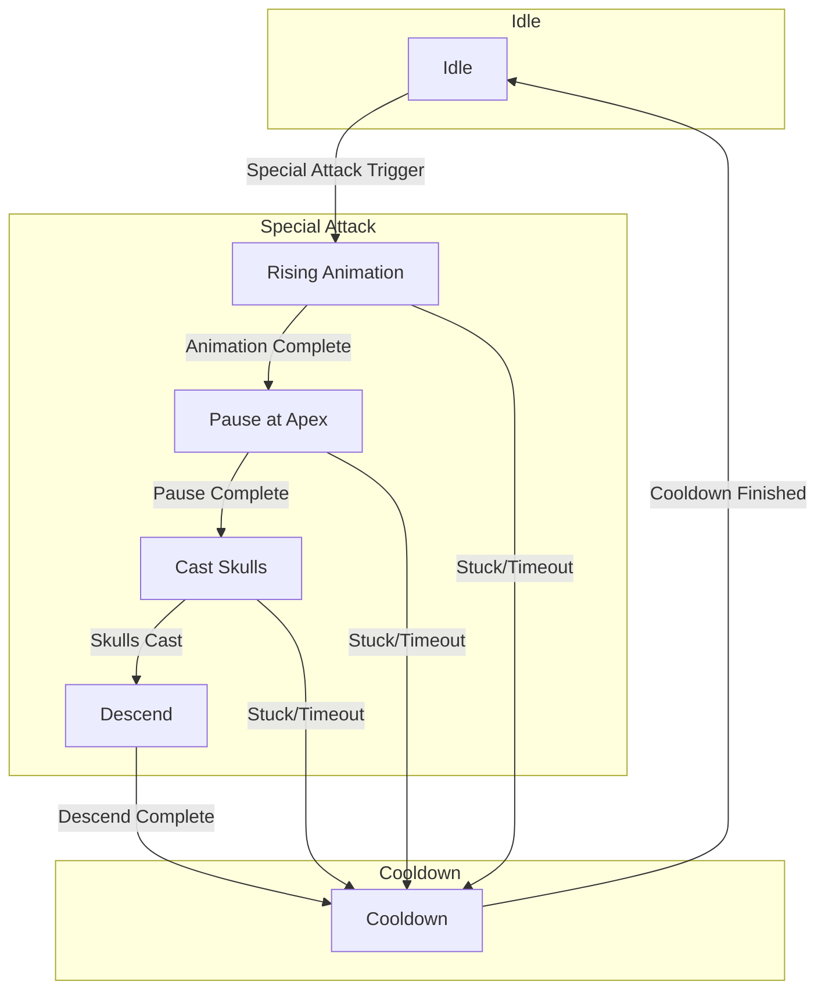

# Boss 1 Attack State Machine

This diagram illustrates the flow of the Boss 1 special attack, including the proposed fixes.

## State Descriptions

*   **Idle**: The boss is in its normal combat state, performing standard attacks.
*   **Rising Animation**: The boss rises into the air. If the animation gets stuck or times out, it will transition directly to Cooldown.
*   **Pause at Apex**: The boss pauses at the highest point of the animation. This is a new state to ensure the skull attack happens at the correct time.
*   **Cast Skulls**: The boss launches its wither skull attack.
*   **Descend**: The boss descends, invulnerable to damage.
*   **Cooldown**: A brief period after the special attack before returning to Idle.

This new state machine introduces a dedicated "Pause at Apex" state to ensure the skull casting is decoupled from the rising animation, preventing the loop. It also includes timeout transitions from all special attack states to the cooldown state as a fail-safe.